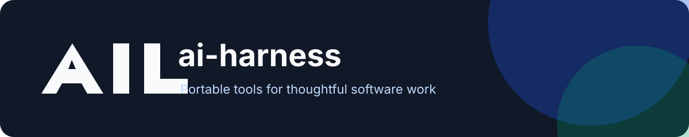

<div align="center">



[](https://github.com/Bruno-Furtado/ai-harness/actions/workflows/ci.yml)
[](./LICENSE)


</div>

<div align="center">
Seus agents, skills, hooks, commands e rules em um só lugar.
</div>

[English version](README.md)

## O que é

O `ai-harness` é uma coleção pública e pequena de configurações reutilizáveis para agentes. As partes portáveis usam padrões abertos. A integração específica de cada ferramenta fica nos adapters.

A ideia é simples: escrever uma vez e usar o mesmo trabalho no OpenCode, Claude Code, Codex, Hermes e outras ferramentas.

## Instalação

Instale as skills deste repositório com o CLI aberto de skills:

```bash
npx skills add Bruno-Furtado/ai-harness
```

O repositório começa com templates e sem uma skill publicada. O comando passa a instalar conteúdo assim que uma skill for adicionada em `skills/<nome>/SKILL.md`.

Para usar toda a coleção localmente:

```bash
git clone https://github.com/Bruno-Furtado/ai-harness.git
cd ai-harness
./sync.sh --dry-run
./sync.sh
```

## Suporte às ferramentas

| Ferramenta | Skills | Agents | Commands | Rules | Hooks |
| --- | :---: | :---: | :---: | :---: | :---: |
| OpenCode | Sim | Sim | Sim | Sim | Adapter |
| Claude Code | Sim | Sim | Sim | Sim | Sim |
| Codex | Sim | Parcial | Parcial | Sim | Sim |
| Hermes | Sim | Não | Não | Sim | Não |
| Outras | Via `npx skills` | Depende | Depende | `AGENTS.md` | Depende |

## Conteúdo

| Caminho | Finalidade |
| --- | --- |
| `agents/` | Exemplos de reviewer read-only e validador entre modelos |
| `skills/` | Skills instaláveis no padrão agentskills.io |
| `commands/` | Prompts reutilizáveis para comandos |
| `hooks/` | Hooks pequenos de segurança compartilhados pelos adapters |
| `rules/` | Regras pessoais globais |
| `adapters/` | Exemplos de integração por ferramenta |
| `docs/templates/` | Templates com critérios de aceite e validação |
| `sync.sh` | Configuração segura e idempotente por symlink |

## Regras de trabalho

- Cada artefato deve ter uma finalidade clara.
- Declare as premissas antes de agir.
- Defina os critérios de aceite antes da implementação.
- Valide o resultado antes de informar que terminou.
- Use um segundo modelo em planos e mudanças importantes.
- Nunca versione credenciais, dados privados ou tokens.
- Prefira a menor mudança que resolve o problema.

## Segurança

O repositório é público. Não adicione secrets ou contexto privado de projetos. A CI verifica secrets vazados e problemas nos scripts shell. Leia [SECURITY.md](SECURITY.md) antes de adicionar hooks ou integrações.

## Contribuição

Leia [CONTRIBUTING.md](CONTRIBUTING.md). Mudanças passam por pull requests. A branch `main` é protegida.

## Licença

MIT. Veja [LICENSE](LICENSE).

<div align="center">
  <sub>Made with ♥ in Curitiba 🇧🇷 🌲 ☔️</sub>
</div>
